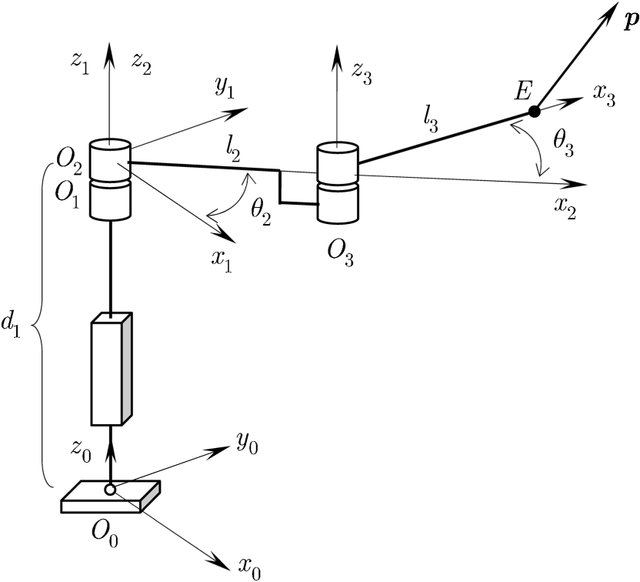

# Tutorial

## 3 DOF PRR serial structure

Let's generate the Equations of Motion for the following serial PRR robot.


Source: *Mansouri, I., & Ouali, M. (2011). Quaternion representation of the power manipulability. Transactions of the Canadian Society for Mechanical Engineering, 35(2), 309-336.*

For the robot definition we are writing a *YAML* file.

Note that instead of typing the whole file, you can also auto generate a template file to adapt, using the following command:

```shell
skidy --template -S "PRR" my_robot.yaml
```

### Define basic parameters

We start by defining the *gravity vector* in negative $z_0$-direction and whether the *coordinate representation* of the joint screw coordinates and the body reference coordinates should be w.r.t. the world frame (`spatial`) or w.r.t. the last link in the chain (`body_fixed`). Here, we chose the representation `spatial`.
As the robot is serial, we don't need to define the parameters `parent`, `support` and `child`.

```yaml
---
gravity: [0,0,-g]

representation: spatial
```

### Define joint screw coordinates

The first joint is `prismatic`, and has its joint *axis* aligned with the global $z_0$-axis. The second and third joint are `revolute` joints also aligned with the $z_0$-axis. As the joint axis of the third joint has the offset $l_2$ along the $x_0$-axis, we need to define the vector to the joint axis using the parameter `vec`.

*Note:* All distances for the robot definition should be taken at the robots stretched out configuration, when all joint positions (in this case $d_1$, $\theta_2$ and $\theta_3$) are set to zero.

```yaml
joint_screw_coord:
  - type: prismatic
    axis: [0,0,1]

  - type: revolute
    axis: [0,0,1]

  - type: revolute
    axis: [0,0,1]
    vec: [l2,0,0]
```

### Define body reference coordinates

Now, we define the positions of the body frames. As we use the stretched out configuration with all joint parameter set to zero, we assume $d_0 = 0$. Hence, the first and second body frame ($O_1$ and $O_2$) are both in the origin of the world frame $O_0$ (no translation). Only the third body frame $O_3$ has an offset of $l_2$ along the $x_0$-axis.
As all body frames are aligned with the world frame, we don't need the parameter `rotation`.

```yaml
body_ref_config:
  - translation: [0,0,0]

  - translation: [0,0,0]

  - translation: [l2,0,0]
```

### Define end-effector configuration w.r.t. last link

Next, we define the position of the end-effector frame $E$ with reference to the last link in the chain $O_3$. Here, we have an offset $l_3$ along the $x_3$-axis.

```yaml
ee:
  translation: [l3,0,0]
```

### Define mass inertia parameters

After we have defined the kinematics of the system, we just have to define the mass inertia parameters of all bodies. Which are the `mass`, the inertia-matrix (`inertia`), and the center of mass (`com`). Let's assume, *all bodies consist of a point mass $m_i$ in the origin of the next frame*.
In this case, the inertia matrix equals to $m_i r_i^2 \cdot \mathbb{I}_{3,3}$. This can be written in the *YAML* file by omission of the identity matrix $\mathbb{I}_{3,3}$. As for the fist body the radius $r_1 = d_1 = 0$, the inertia equals to zero too. For the second body, the radius $r = l_2$ and the center of mass has an offset about $l_2$ along the $x_2$-axis. Accordingly, we define the inertia of the third body.

```yaml
mass_inertia:
  - mass: m1
    inertia: 0
    com: [0,0,0]

  - mass: m2
    inertia: m2*l2**2
    com: [l2,0,0]

  - mass: m3
    inertia: m3*l3**2
    com: [l3,0,0]
```

### Define generalized joint vectors

Finally, we have to define symbols for the joint positions, velocities and accelerations. For simplicity, we use `q1`, `q2` and `q3` for $d_1$, $\theta_2$ and $\theta_3$. Velocities are given the prefix `d` and accelerations `dd`.

```yaml
q: [q1,q2,q3]
qd: [dq1, dq2, dq3]
q2d: [ddq1, ddq2, ddq3]
```


### Generate equations of motion

The whole file should now look like this:

```yaml
---
gravity: [0,0,-g]

representation: spatial

joint_screw_coord:
  - type: prismatic
    axis: [0,0,1]

  - type: revolute
    axis: [0,0,1]

  - type: revolute
    axis: [0,0,1]
    vec: [l2,0,0]

body_ref_config:
  - translation: [0,0,0]

  - translation: [0,0,0]

  - translation: [l2,0,0]

ee:
  translation: [l3,0,0]

mass_inertia:
  - mass: m1
    inertia: 0
    com: [0,0,0]

  - mass: m2
    inertia: m2*l2**2
    com: [l2,0,0]

  - mass: m3
    inertia: m3*l3**2
    com: [l3,0,0]

q: [q1,q2,q3]
qd: [dq1, dq2, dq3]
q2d: [ddq1, ddq2, ddq3]
```

Assuming you have saved this file with the name `my_robot.yaml` you can now use *skidy* to generate e.g. python code and a latex file, containing symbolic equations of motion:

```shell
skidy -s --python --latex my_robot.yaml
```

You will find the generated files in the folder `generated_code`.
